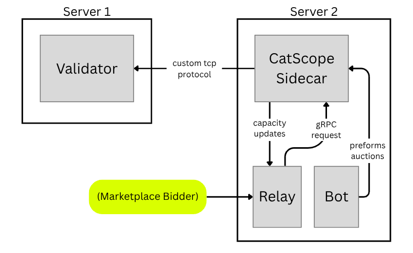

# catscope-validator

This guide walks you through setting up a CatScope-compatible validator, enabling real-time account graph streaming and MEV-powered trading infrastructure on Solana.

To run the system, you will need two servers, as shown in the diagram below:

* Validator Server: Runs the modified Agave validator with CatScope hooks. This server generates the real-time account graph from decoded Solana account data.

* Sidecar Server (connected via localhost or private network): Runs the sidecar, bot, and relay.
  * The **sidecar** streams live account updates from the validator and exposes them to bots via gRPC.
  * The **relay** forwards incoming transaction requests from external clients.
  * The **bot** performs auctions and sorts winning transactions by proportion for submission based on MEV opportunity.(i.e. highest bidders received greater transactions per sec)

All components are installed as daemonized processes using **systemd.**



# Table of Contents

1. [Prerequisites](#prerequisites)  
2. [System Requirements](#system-requirements)
3. [Install CatScope Debian Packages](#install-catscope-debian-packages)  
4. [Validator Server Setup](validator-setup.md)  
5. [Sidecar Server Setup](sidecar-setup.md)  
6. [Bot and Relay Setup](start-pipeline.md)

## Prerequisites

```
sudo apt update && sudo ??????????
```

To run a CatScope Validator, you will need:

* 2 servers:
  * One for the Validator
  * One for the CatScope Sidecar and marketplace processes
* A private network connection or firewall between the two machines to ensure secure communication.

## System Requirements

| Role      | CPU         | RAM        | Disk     |
|-----------|-------------|------------|----------|
| Validator | 32+ cores | 768 GB | 1.7 TB |
| Sidecar   | 20+ cores   | 250 GB     | 0.7 TB |

## Install CatScope Debian Packages

**This section is still TBD**

Download and install the following Debian packages (`.deb`) on the appropriate machines:

### On the **Validator Server**

* `catscope-validator`: A fork of Agave validator with support for CatScope hooks.
* `catscope-geyser`: Enables real-time read access for streaming graph data.
* `solpipe-filter`: The default edge generator, which supports the graph creation of marketplace users.

Operators can use [any edge generator, including this example one](https://github.com/noncepad/catscope-edge-generator).  A sample geyser json file `/etc/catscope/geyser.json` is below:

```json
{
   "libpath":"/usr/lib/libsolana_geyser_plugin_catscope.so",
   "filter": "/usr/share/catscope/catscope_edge_generator.wasm",
   "filter_count": 128,
   "filter_args":"/etc/catscope/program.txt",
   "bot":{
      "core_count": 2
   },
   "worker_count":36,
   "log":{
      "level":"warn"
   },
   "net":{
      "listen_url":"127.0.0.1:57451",
      "ring_size": 1024,
      "buffer_size": 1048576,
      "max_write": 1024,
      "store_dir":"/var/share/catscope"
    },
    "shooter":{
      "broadcast_path":"/validator",
      "version":1,
      "buffer_size":1000000
    },
    "node_capacity":1000000000
}
```

```cli
apt-get install ...
```

The side car communicates with the Validator via TCP port 57451.  The side car should be on a private network and we recommend
firewall settings to control access to this port.

Low latency account updates are transmitted via zeromq from the validator to the sidecar as well.  [See shooter.md](shooter.md)
instructions on how to configure the producer and consumers.  If the sidecar runs on the same server as the validator
(not recommended), then no network traffic is necessary as changes are available directly via shared memory buffer.

### On the **Sidecar Server**

* `catscope-sidecar`: A gRPC service that streams and receives validator data in real time.

```cli
apt-get install ...
```

> You can verify install success with:
>
> ```cli
> ls -la /usr/bin/catscope-grpc-server
> ls -la /usr/bin/agave-validator
> ```

> Need help? Contact us:
<https://catscope.io/contact/>

### Confug
