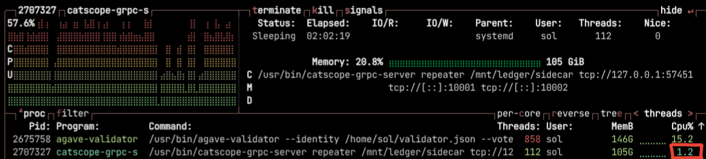

# CatScope Sidecar Setup

The CatScope Sidecar is a companion service that runs alongside the validator on a separate machine. It acts as a local relay and data router for marketplace activity, bridging communication between catscope marketplace bots, relays, and the validator via custom protocols and gRPC.

---------

## On the **Sidecar Server**

- `catscope-sidecar`: A gRPC service that streams and receives validator data in real time.

```cli
apt-get install ...
```

> You can verify install success with:
>
> ```cli
> ls -la /usr/bin/catscope-grpc-server
> ```

## Create CatScope Sidecar User

Create a dedicated user that will run the sidecar:

```bash
useradd -r -M -s /usr/sbin/nologin user
```

> Ensure necessary directories and files are owned by this user:

```bash
sudo chown user:user /etc/default/catscope-grpc-server
sudo chmod 600 /etc/default/catscope-grpc-server

```

> Verify permissions:

```bash
ls -la /etc/default/catscope-grpc-server
ls -la /etc/default/catscope-grpc-server
```

## Start the Sidecar

The CatScope Sidecar runs on a separate server and connects to the validator over a private TCP connection. It receives decoded validator state, streams graph data to bots, and handles gRPC requests.

Create start-sidecar.sh:

```bash
#!/bin/bash

exec /usr/bin/catscope-grpc-server repeater \
  /mnt/ledger/sidecar \
  tcp://127.0.0.1:57451 \
  tcp://[::]:10001 \
  tcp://[::]:10002
```

Make it executable:

```bash
chmod +x /home/sol/start-sidecar.sh
```

### Create systemd Service

Create `/etc/systemd/system/catscope.service`:

```bash
[Unit]
Description=CatScope Sidecar gRPC Server
After=network.target

[Service]
ExecStart=/usr/bin/catscope-grpc-server repeater /mnt/ledger/sidecar $VALIDATOR_CATSCOPE_URL $LISTEN_STATE_URL $LISTEN_TXPROC_URL
# To debug memory leaks, uncomment the following line:
# ExecStart=/usr/bin/valgrind --leak-check=full --track-origins=yes /usr/bin/catscope-grpc-server repeater /mnt/ledger/sidecar $VALIDATOR_CATSCOPE_URL $LISTEN_STATE_URL $LISTEN_TXPROC_URL

Restart=on-failure
RestartSec=10
MemoryMax=120G
User=sol
Group=sol
WorkingDirectory=/mnt/ledger/sidecar
EnvironmentFile=/etc/default/catscope-grpc-server.sh

[Install]
WantedBy=multi-user.target
```

### Create Enviorment File

Create `/etc/default/catscope-grpc-server.sh` with:

```bash
NETWORK=testnet
VALIDATOR_CATSCOPE_URL=tcp://127.0.0.1:57451
LISTEN_STATE_URL=tcp://[::]:10001
LISTEN_TXPROC_URL=tcp://[::]:10002

# Optional profiling/debug
# PPROF_URL=tcp://[::]:11433
# PPROF_FILE_PATH=/tmp/catscope.prof
# GODEBUG=efence=1

RUST_BACKTRACE=full
RUST_LOG=warn,catscope_tree::tree=warn
DECOMPRESS_WORKER_COUNT=24
WORKING_DIR=/mnt/ledger/sidecar
```

Start the sidecar using systemd:

```bash
sudo systemctl start catscope
```

Check logs to ensure it’s running properly:

```bash
sudo journalctl -u catscope --follow
```

## Verify the Sidecar is Running and Synced

Once the sidecar starts, it will stream the full Solana state snapshot from the validator, which may take ~30 minutes, depending on disk and CPU speed. You should confirm both memory usage and slot sync before proceeding.

### Monitor Resource Usage (btop or htop)

During sync, the sidecar will consume high CPU. CPU usage may spike and fluctuate. Once syncing completes, usage will drop and stabilize.



### Check Slot Differential Between Validator and Sidecar
>
> **Slot Check Only Works After RAM Peaks**
> The next step (slot sync check) is only meaningful after memory usage is close to 100 GB — this indicates the sidecar has mostly loaded the state snapshot and begun streaming.

```bash
journalctl -u catscope -n3 | grep slot | \
perl -e '$val=`solana -u http://localhost:8899 slot`;chomp($val); \
while($x=<STDIN>){if($x=~m#slot (\d+)$#){$y=$1; $diff=($y-$val); print "$diff\n"; exit 0;}}'
```

- Output should be around ±31 when synced
- If output is large (e.g. -50000), the sidecar is still catching up

### Look for `doSlotRoot` in Logs

Once synced, you’ll see lines like this in the logs:

```log
Jun 18 05:41:49 testnet-validator-astralane-2 catscope-grpc-server[1268669]: 
time=2025-06-18T05:41:49Z level=warning msg=doSlotRoot - 2 - slot 340348256
```

These indicate that slot data is being successfully processed and streamed.

Need help? Contact us:
<https://catscope.io/contact/>

