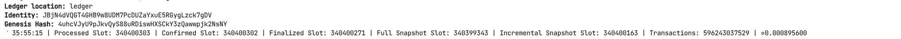

# CatScope Validator Setup

CatScope enables Solana validators to provide real-time account graph streaming and MEV marketplace access for traders. This guide covers setting up a CatScope-compatible validator and sidecar using Debian packages and systemd.

---------

## Start the Validator

Start your validator just as you would with [Agave](https://github.com/anza-xyz/agave), using the `catscope-validator` binary. The node will take some time (~2 hours) to catch up with the Solana network.

Create `start-validator.sh`:
```bash
#!/bin/bash

exec /usr/bin/agave-validator \
  --identity /home/sol/validator.json \
  --vote-account 5Y7DLnF3HDC2JygZuWypypFfLxkmVLaAuc9TSAd6jhYi \
  --ledger /mnt/ledger \
  --accounts /mnt/accounts \
  --rpc-port 8899 \
  --no-port-check \
  --dynamic-port-range 8000-8020 \
  --entrypoint entrypoint.testnet.solana.com:8001 \
  --entrypoint entrypoint2.testnet.solana.com:8001 \
  --entrypoint entrypoint3.testnet.solana.com:8001 \
  --expected-genesis-hash 4uhcVJyU9pJkvQyS88uRDiswHXSCkY3zQawwpjk2NsNY \
  --wal-recovery-mode skip_any_corrupted_record \
  --known-validator 5D1fNXzvv5NjV1ysLjirC4WY92RNsVH18vjmcszZd8on \
  --geyser-plugin-config /etc/catscope/geyser.json \
  --limit-ledger-size
```
Create a systemd service:

`/etc/systemd/system/agave-validator.service`

```ini
[Unit]
Description=Agave (Solana) Validator Service                                         
After=network-online.target                                                          
Wants=network-online.target                                                          
                                                                                     
[Service]                                                                            
User=sol                                                                            
Group=sol                                                                           
                                                                                     
# Path to solana-validator binary                                                    
ExecStart=/home/sol/start-validator.sh

#  --only-known-rpc \

#  --log /home/sol/solana-validator.log \

EnvironmentFile=/etc/default/agave-validator                        
# Restart the service on failure, wait for 10 seconds before retrying
# Restart=on-failure                                                                   
# RestartSec=120s                                                                      
Restart=never                                         
# Limit memory and CPU usage (optional)                                              
LimitNOFILE=1000000                                                                  
# CPUShares=1024                                                                      
# StandardOutput=append:/home/sol/validator.log
# StandardError=append:/home/sol/validator.log

[Install]                 
WantedBy=multi-user.target
```
> Make sure the all filepaths exist on your system.


## Create Environment File

Create `/etc/default/agave-validator` with the following contents:

```bash
RUST_LOG=info,solana_geyser_plugin_manager=warn,solana_geyser_plugin_catscope=warn,catscope_tree=warn,catscope_primitive=warn,catscope_host=warn,catscope_primitive::server=warn,catscope_primitive::serverclient=warn
# RUST_LOG=debug
RUST_BACKTRACE=full
RUST_STACKTRACE=1
# PPROF_FILE_PATH=/tmp/pprof
FILTER_INIT_ARGS=/etc/catscope/program.txt
# FILTER_PATH=/home/ubuntu/geyser/solpipe_filter.wasm
LISTEN_URL=0.0.0.0:57451
```
> This file will be automatically sourced by systemd when running the agave-validator service.

## Create Solana Validator User

Create a dedicated user that will run the validator process:

```bash
useradd -r -M -s /usr/sbin/nologin user
```
> Ensure necessary directories and files are owned by this user:

```bash 
sudo chown user:user /etc/default/agave-validator
sudo chmod 600 /etc/default/agave-validator

```
> Verify permissions:
```bash
ls -la /etc/default/agave-validator
```

## Start the Validator

Start the validator using systemd:
```bash
sudo systemctl start agave-validator
```

Check logs to ensure it’s running properly:

```bash
sudo journalctl -u agave-validator --follow
```

## Monitor Validator Status

```bash
cd /mnt
agave-validator monitor
```
Once you see processed and finalized slots advancing consistently, as seen below, the validator is up and synced. You can then proceed to sidecar setup.




## Manage the Validator Service
You can control the validator process using standard systemd commands.

Restart the validator:
```bash
sudo systemctl restart agave-validator
```
Check validator status:
```bash
sudo systemctl status agave-validator
```

Stop the validator:
```bash
sudo systemctl stop agave-validator
```

## Troubleshooting: Snapshot Download Failure
If your validator fails to download the snapshot or gets stuck during startup, manually downloading the snapshot files can speed up the boot process and help resolve the issue.

Run this command before restarting the validator:

```bash
sudo -u sol /bin/bash -c 'cd /mnt/ledger && wget --continue --trust-server-names http://198.244.253.220:9099/snapshot.tar.bz2 && wget --continue --trust-server-names http://198.244.253.220:9099/incremental-snapshot.tar.bz2'
```
This will place the snapshot files directly in /mnt, allowing the validator to pick them up on the next boot.

> Use this if the validator logs show repeated failures to fetch the snapshot or the sync process is unusually slow.